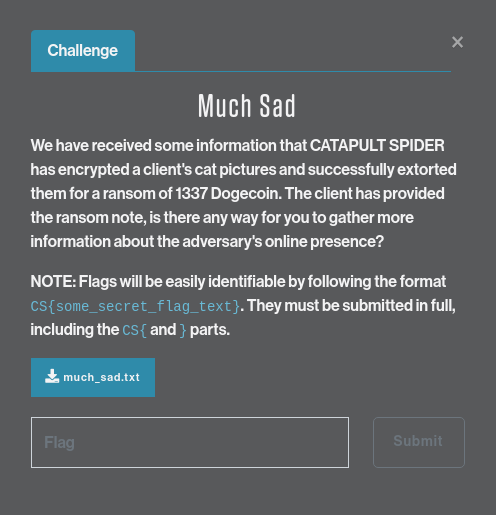
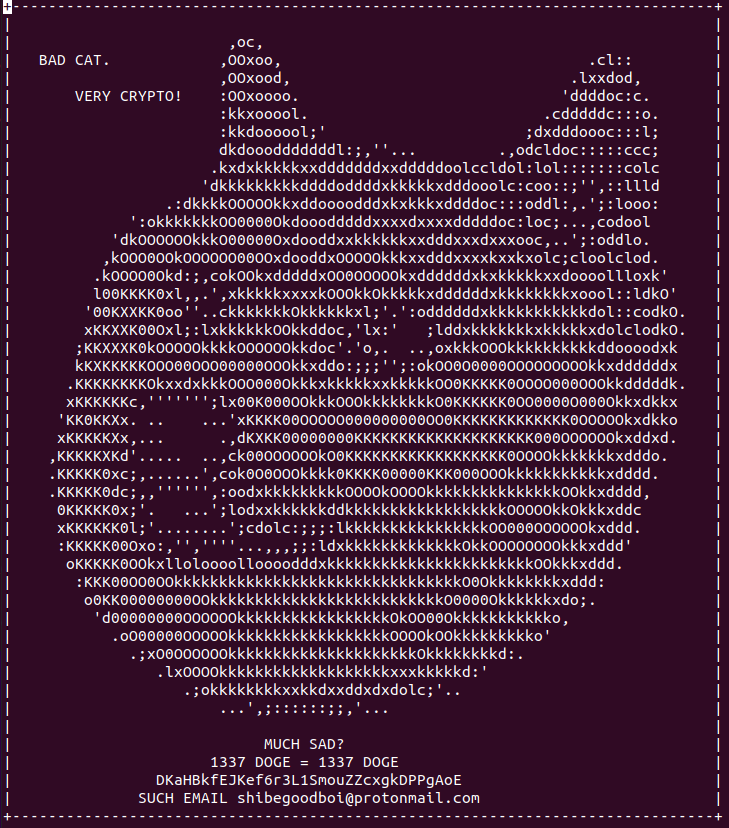
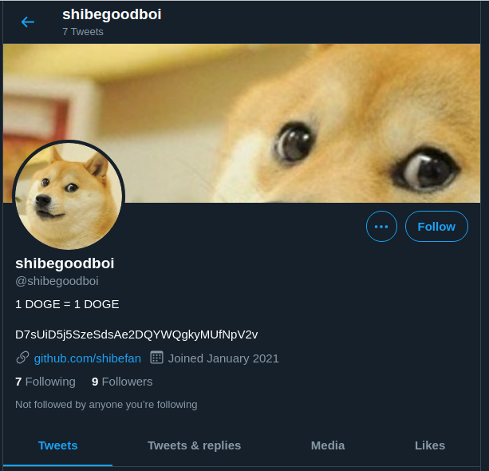
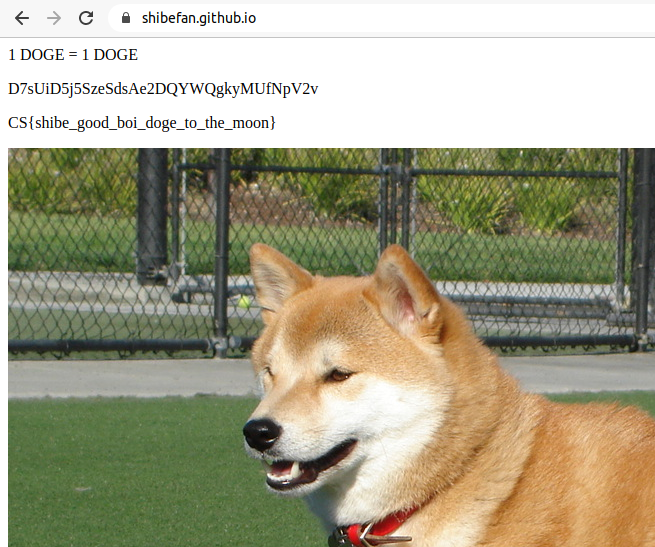

# CATAPULT SPIDER - Much Sad

This is an OSINT challenge: find the flag in the publically-available information 
CATAPULT SPIDER has left online.

## Challenge description

> We have received some information that CATAPULT SPIDER has encrypted a client's cat pictures and successfully extorted them for a ransom of 1337 Dogecoin. The client has provided the ransom note, is there any way for you to gather more information about the adversary's online presence?

> NOTE: Flags will be easily identifiable by following the format `CS{some_secret_flag_text}`. They must be submitted in full, including the `CS{` and `}` parts.

## Solution

We're given a file to download `muchsad.txt`:

Two things jump out: a Dogecoin wallet address: `DKaHBkfEJKef6r3L1SmouZZcxgkDPPgAoE`
and an email address `shibegoodboi@protonmail.com`. Plugging
`shibegoodboi` into Google yields a few promising hits: a Twitter account
[https://twitter.com/shibegoodboi](https://twitter.com/shibegoodboi) and a Reddit profile
[https://www.reddit.com/user/shibegoodboi/](https://www.reddit.com/user/shibegoodboi/). 

Visiting the Twitter page a link to a GitHub repository [https://github.com/shibefan](https://github.com/shibefan):

In shibefan's repositories is one for [https://shibefan.github.io](https://shibefan.github.io/).
We can either browse through the repository and view the `index.html` of the page, or just
visit [https://shibefan.github.io](https://shibefan.github.io/):

And there's the flag: CS{shibe_good_boi_doge_to_the_moon}

## Answer
**`CS{shibe_good_boi_doge_to_the_moon}`**
