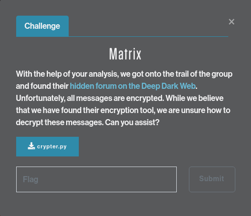
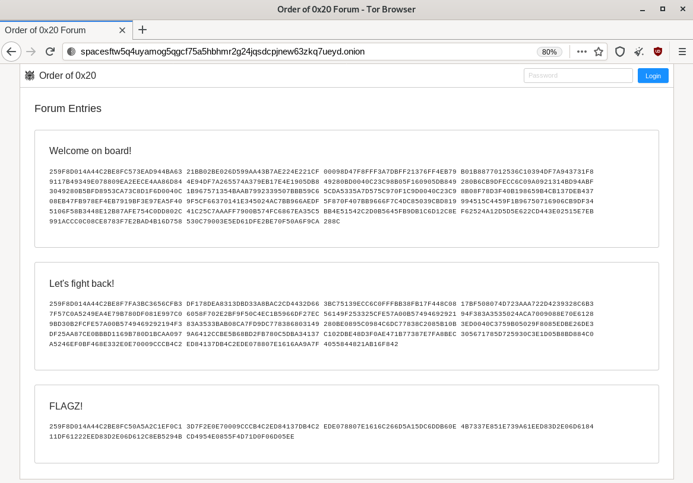

# SPACE JACKAL - Matrix

A bit more difficult of a challenge: reverse-engineering a custom encryption program
to decipher messages from the SPACE JACKAL hidden forum.

## Challenge description



> With the help of your analysis, we got onto the trail of the group and found their [hidden forum on the Deep Dark Web](http://spacesftw5q4uyamog5qgcf75a5hbhmr2g24jqsdcpjnew63zkq7ueyd.onion/). Unfortunately, all messages are encrypted. While we believe that we have found their encryption tool, we are unsure how to decrypt these messages. Can you assist?

## Solution

The 'forum' with the messages is a `TOR` site: [http://spacesftw5q4uyamog5qgcf75a5hbhmr2g24jqsdcpjnew63zkq7ueyd.onion/](http://spacesftw5q4uyamog5qgcf75a5hbhmr2g24jqsdcpjnew63zkq7ueyd.onion/). Using [TAILS](https://tails.boum.org/) & the `TOR Browser`, we can retrieve the messages:



**Welcome on board!**
```
259F8D014A44C2BE8FC573EAD944BA63 21BB02BE026D599AA43B7AE224E221CF 00098D47F8FFF3A7DBFF21376FF4EB79
B01B8877012536C10394DF7A943731F8 9117B49349E078809EA2EECE4AA86D84 4E94DF7A265574A379EB17E4E1905DB8
49280BD0040C23C98B05F160905DB849 280B6CB9DFECC6C09A0921314BD94ABF 3049280B5BFD8953CA73C8D1F6D0040C
1B967571354BAAB7992339507BBB59C6 5CDA5335A7D575C970F1C9D0040C23C9 8B08F78D3F40B198659B4CB137DEB437
08EB47FB978EF4EB7919BF3E97EA5F40 9F5CF66370141E345024AC7BB966AEDF 5F870F407BB9666F7C4DC85039CBD819
994515C4459F1B96750716906CB9DF34 5106F58B3448E12B87AFE754C0DD802C 41C25C7AAAFF7900B574FC6867EA35C5
BB4E51542C2D0B5645FB9DB1C6D12C8E F62524A12D5D5E622CD443E02515E7EB 991ACCC0C08CE8783F7E2BAD4B16D758
530C79003E5ED61DFE2BE70F50A6F9CA 288C
```

**Let's fight back!**
```
259F8D014A44C2BE8F7FA3BC3656CFB3 DF178DEA8313DBD33A8BAC2CD4432D66 3BC75139ECC6C0FFFBB38FB17F448C08
17BF508074D723AAA722D4239328C6B3 7F57C0A5249EA4E79B780DF081E997C0 6058F702E2BF9F50C4EC1B5966DF27EC
56149F253325CFE57A00B57494692921 94F383A3535024ACA7009088E70E6128 9BD30B2FCFE57A00B5749469292194F3
83A3533BAB08CA7FD9DC778386803149 280BE0895C0984C6DC77838C2085B10B 3ED0040C3759B05029F8085EDBE26DE3
DF25AA87CE0BBBD1169B780D1BCAA097 9A6412CCBE5B68BD2FB780C5DBA34137 C102DBE48D3F0AE471B77387E7FA8BEC
305671785D725930C3E1D05B8BD884C0 A5246EF0BF468E332E0E70009CCCB4C2 ED84137DB4C2EDE078807E1616AA9A7F
4055844821AB16F842
```

**FLAGZ!**
```
259F8D014A44C2BE8FC50A5A2C1EF0C1 3D7F2E0E70009CCCB4C2ED84137DB4C2 EDE078807E1616C266D5A15DC6DDB60E
4B7337E851E739A61EED83D2E06D6184 11DF61222EED83D2E06D612C8EB5294B CD4954E0855F4D71D0F06D05EE
```

We're given the the Python used to encrypt the messages, but no indication of the key used to 
encrypt:

```python linenums="1"
#!/usr/bin/env python3
# -*- coding: utf-8 -*-
'''              ,
                /|      ,
   ,--.________/ /-----/|-------------------------------------.._
  (    /_/_/_/_  |--------- DEATH TO ALL TABS ---------------<  _`>
   `--´        \ \-----\|-------------------------------------''´
                \|      '
'''#             '
assert __name__ == '__main__'
import sys
def die(E):
#    print(F'E:',E,file=sys.stderr)
    sys.exit(1)
T=lambda A,B,C,D,E,F,G,H,I:A*E*I+B*F*G+C*D*H-G*E*C-H*F*A-I*D*B&255
def U(K):
    R=pow(T(*K),-1,256)
    A,B,C,D,E,F,G,H,I=K
    return [R*V%256 for V in
     [E*I-F*H,C*H-B*I,B*F-C*E,F*G-D*I,A*I-C*G,C*D-A*F,D*H-E*G,B*G-A*H,A*E-B*D]]
def C(K,M):
    B=lambda A,B,C,D,E,F,G,H,I,X,Y,Z:bytes((A*X+B*Y+C*Z&0xFF,
        D*X+E*Y+F*Z&0xFF,G*X+H*Y+I*Z&0xFF))
    N=len(M)
    R=N%3
    R=R and 3-R
    M=M+R*B'\0'
    return B''.join(B(*K,*W) for W in zip(*[iter(M)]*3)).rstrip(B'\0')
len(sys.argv) == 3 or die('FOOL')
K=bytes(sys.argv[2], 'ascii')
len(K)==9 and T(*K)&1 or die('INVALID')
M=sys.stdin.read()
if sys.argv[1].upper() == 'E':
    M=B'SPACEARMY'+bytes(M,'ascii')
    print(C(U(K),M).hex().upper())
else:
    M=C(K,bytes.fromhex(M))
    M[:9]==B'SPACEARMY' or die('INVALID')
    print(M[9:].decode('ascii'))
```

From the code, we can determine a few things about how the program works:

- The program expects two arguments:

```python linenums="29"
len(sys.argv) == 3 or die('FOOL')
```

- The key is in the `ASCII` character set:

```python linenums="30"
K=bytes(sys.argv[2], 'ascii')
```

- The key is 9 characters long, and the lowest bit of the key is `1`:

```python linenums="31"
len(K)==9 and T(*K)&1 or die('INVALID')
```

- And very importantly, we know that the first 9 characters of every message is the string 
`SPACEARMY`:

```python linenums="33" hl_lines="2 6"
if sys.argv[1].upper() == 'E':
    M=B'SPACEARMY'+bytes(M,'ascii')
    print(C(U(K),M).hex().upper())
else:
    M=C(K,bytes.fromhex(M))
    M[:9]==B'SPACEARMY' or die('INVALID')
    print(M[9:].decode('ascii'))
```

This gives a set of known plaintext->ciphertext values that we can use to derive the key 
and decrypt the rest of the message. The encryption is performed by the function `C()`:

```python linenums="21" hl_lines="2 3 8"
def C(K,M):
    B=lambda A,B,C,D,E,F,G,H,I,X,Y,Z:bytes((A*X+B*Y+C*Z&0xFF,
        D*X+E*Y+F*Z&0xFF,G*X+H*Y+I*Z&0xFF))
    N=len(M)
    R=N%3
    R=R and 3-R
    M=M+R*B'\0'
    return B''.join(B(*K,*W) for W in zip(*[iter(M)]*3)).rstrip(B'\0')
```

Lines 22/23 perform the encryption: the first 3 values of the plaintext bytes (`X`,
`Y`, and `Z`) multiplied by the first 3 bytes of the key (`A`, `B`, and `C`), added
together, then the lower 8 bits are returned for the first byte of the ciphertext. The
calculation is repeated with the same byte of plaintext `X` `Y` and `Z`, with the remaining
bytes of the key in sets of 3: `D` `E` `F`, and `G` `H` `I`.

On it's own, knowing the algorithm isn't enough to be able to decipher the messages. But
with the phrase `SPACEARMY` prepended to the message before encryption, we can use
that known plaintext with the first 9 bytes of the ciphertext to compute the key. Using the
nomenclature from the encryption routine, the computations work out like this:

```
PT[] = Plaintext
CT[] = Ciphertext
A-I = bytes of the key, eg A = K[0], B = K[1], ...

CT[0] = ((A * PT[0]) + (B * PT[1]) + (C * PT[2])) & 0xFF
CT[1] = ((D * PT[0]) + (E * PT[1]) + (F * PT[2])) & 0xFF
CT[2] = ((G * PT[0]) + (H * PT[1]) + (I * PT[2])) & 0xFF

CT[3] = ((A * PT[3]) + (B * PT[4]) + (C * PT[5])) & 0xFF
CT[4] = ((D * PT[3]) + (E * PT[4]) + (F * PT[5])) & 0xFF
CT[5] = ((G * PT[3]) + (H * PT[4]) + (I * PT[5])) & 0xFF

CT[6] = ((A * PT[6]) + (B * PT[7]) + (C * PT[8])) & 0xFF
CT[7] = ((D * PT[6]) + (E * PT[7]) + (F * PT[8])) & 0xFF
CT[8] = ((G * PT[6]) + (H * PT[7]) + (I * PT[8])) & 0xFF
...
```

Re-arranging the calculations to combine the common key values gives this:

```
CT[0] = ((A * PT[0]) + (B * PT[1]) + (C * PT[2])) & 0xFF
CT[3] = ((A * PT[3]) + (B * PT[4]) + (C * PT[5])) & 0xFF
CT[6] = ((A * PT[6]) + (B * PT[7]) + (C * PT[8])) & 0xFF

CT[1] = ((D * PT[0]) + (E * PT[1]) + (F * PT[2])) & 0xFF
CT[4] = ((D * PT[3]) + (E * PT[4]) + (F * PT[5])) & 0xFF
CT[7] = ((D * PT[6]) + (E * PT[7]) + (F * PT[8])) & 0xFF

CT[2] = ((G * PT[0]) + (H * PT[1]) + (I * PT[2])) & 0xFF
CT[5] = ((G * PT[3]) + (H * PT[4]) + (I * PT[5])) & 0xFF
CT[8] = ((G * PT[6]) + (H * PT[7]) + (I * PT[8])) & 0xFF
```

We have 3 equations, with 3 unknowns (`A B C`, `D E F`, `G H I`). The following Python code
takes reads the ciphertext from `stdin`, converts it from `hex` to `bytes`, then uses the 
known plaintext `SPACEARMY` to brute-force the key:

```python
#!/usr/bin/env python3

# Decrypt SPACE JACKAL's encrypted messages
#
# Joe Ammond (pugpug), @joeammond

import sys

# Brute-force the solution to the equations:
# ((X * A) + (Y * B) + (Z * C)) & 0xFF == v1
# ((X * D) + (Y * E) + (Z * F)) & 0xFF == v2
# ((X * G) + (Y * H) + (Z * I)) & 0xFF == v3

def solve(v1, v2, v3, K):
    '''Solve 3 equations/3 unknowns. K = key, 9 bytes long'''

    A, B, C, D, E, F, G, H, I = K

    for X in range(255):
        for Y in range(255):
            for Z in range(255):
                if ((X * ord(A)) + (Y * ord(B)) + (Z * ord(C))) & 0xFF == v1 and \
                   ((X * ord(D)) + (Y * ord(E)) + (Z * ord(F))) & 0xFF == v2 and \
                   ((X * ord(G)) + (Y * ord(H)) + (Z * ord(I))) & 0xFF == v3:
                       return(X, Y, Z)


# Read the ciphertext from stdin, and convert from hex to bytes
C = sys.stdin.read()
C = bytes.fromhex(C)

# Key array
K = ''

# For each set of 3 key elements, solve for the known plaintext of 'SPACEARMY'
for i in range(3):
    k1, k2, k3 = solve(C[i], C[i+3], C[i+6], 'SPACEARMY')
    K = K + chr(k1) + chr(k2) + chr(k3)

print('Key values found:', ' '.join('%02x'%ord(K[i]) for i in range(len(K))))
print()
```

Piping in one of the cipher texts will reveal the bytes of the key used to encrypt the message:

```shell
xps15$ python3 decrypt.py < cipher1.txt
Key values found: cf 1c 48 4c df 8b 6d 0b 46
```

Now that we have the key used to encrypt the messages, we can use the same function to decrypt
the rest of the message. Adding the following to the program will decrypt and print the 
message:

```python
# Now we have the key, brute-force the message text from the ciphertext. Strip off the
# 'SPACEARMY' header from the message first.

C = C[9:]

# Plaintext string
P = ''

for X, Y, Z in zip(*[iter(C)]*3):
    p1, p2, p3 = solve(X, Y, Z, K)
    P = P + chr(p1) + chr(p2) + chr(p3)

print(P)
```

And now we can decrypt the 3 messages from the Deep Dark Web forum:

### Message 1: Welcome on board!
```shell-session
xps15$ python3 decrypt.py < cipher1.txt
Key values found: cf 1c 48 4c df 8b 6d 0b 46

Welcome on board and congratulations on joining the Order of 0x20.

Together we will fight the good fight and bring enlightenment to the non-believers: Let's stop the global TAB infestation once and for all. This forum is a place to share news and coordinate action, but be careful: you never know who's watching.

 040 == 32 == 0x20

-- admin.
```

### Message 2: Let's fight back!
```shell-session
xps15$ python3 decrypt.py < cipher2.txt
Key values found: cf 1c 48 4c df 8b 6d 0b 46

My name is rudi. i was fired by my Old employer because I refused to use TABs. THIS madness must be STOPPED! These people must be STOPPED!1! But I fought back! I hacked their network established access. Let me know if you have an idea how to take revegne!

 040 == 32 == 0x20

-- rudi.
```

### Message 3: FLAGZ!
```shell-session
xps15$ python3 decrypt.py < cipher3.txt
Key values found: cf 1c 48 4c df 8b 6d 0b 46

Good job!

 040 == 32 == 0x20

CS{if_computers_could_think_would_they_like_spaces?}
```

## Answer
**`CS{if_computers_could_think_would_they_like_spaces?}`**
