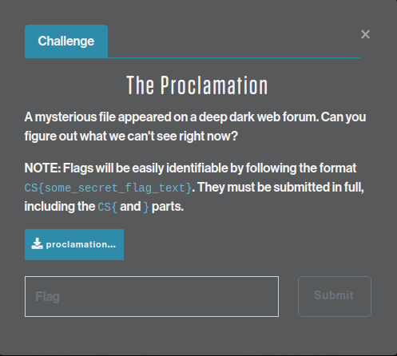
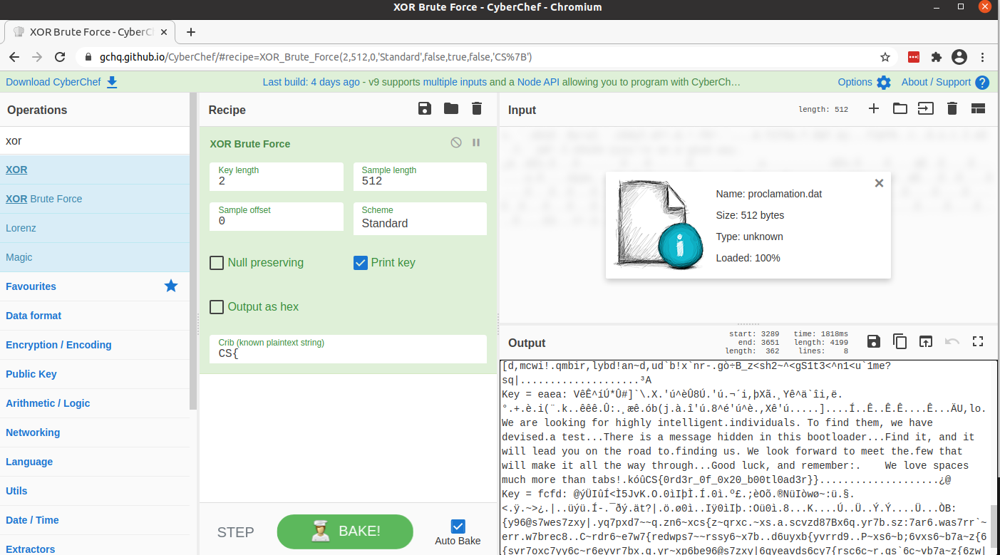

# SPACE JACKAL - The Proclamation

An easy challenge to start off the CTF: find the hidden message in a file.

## Challenge description



> A mysterious file appeared on a deep dark web forum. Can you figure out what we can't see right now?

> NOTE: Flags will be easily identifiable by following the format `CS{some_secret_flag_text}`. They must be submitted in full, including the `CS{` and `}` parts.

## Solution

The first challenge for SPACE JACKAL is "The Proclamation", where we're given a
[file](proclamation.dat) to download and examine. `file` and `xxd` reveal it's a `DOS MBR` boot
sector, with some text inside it: `you're on a good way`. The last part of the file is 
random-appearing binary data:

```bash
xps15$ file proclamation.dat
proclamation.dat: DOS/MBR boot sector

xps15$ xxd proclamation.dat
00000000: bc00 20b4 0730 c031 c9b7 8ab6 61b2 61cd  .. ..0.1....a.a.
00000010: 10b4 0231 d230 ffcd 10eb 465e 83c6 14b2  ...1.0....F^....
00000020: 0966 52b3 00b4 0e8a 0483 c601 665a 66c1  .fR.........fZf.
00000030: e202 6683 c242 6681 e2ff 0000 0066 31d0  ..f..Bf......f1.
00000040: 6652 0c00 7419 88c2 80f2 0a74 04cd 10eb  fR..t......t....
00000050: d2b4 03cd 10b4 02fe c6b2 00cd 10eb c4fa  ................
00000060: f4e8 b7ff 796f 7527 7265 206f 6e20 6120  ....you're on a
00000070: 676f 6f64 2077 6179 2ebf c686 85c4 cabd  good way........
00000080: 8fca 8b98 8fca 8685 8581 8384 8dca 8c85  ................
00000090: 98ca 8283 8d82 8693 ca83 849e 8f86 8683  ................
000000a0: 8d8f 849e e083 848e 839c 838e 9f8b 8699  ................
000000b0: c4ca be85 ca8c 8384 8eca 9e82 8f87 c6ca  ................
000000c0: 9d8f ca82 8b9c 8fca 8e8f 9c83 998f 8ee0  ................
000000d0: 8bca 9e8f 999e c4e0 e0be 828f 988f ca83  ................
000000e0: 99ca 8bca 878f 9999 8b8d 8fca 8283 8e8e  ................
000000f0: 8f84 ca83 84ca 9e82 8399 ca88 8585 9e86  ................
00000100: 858b 8e8f 98c4 e0e0 ac83 848e ca83 9ec6  ................
00000110: ca8b 848e ca83 9eca 9d83 8686 ca86 8f8b  ................
00000120: 8eca 9385 9fca 8584 ca9e 828f ca98 858b  ................
00000130: 8eca 9e85 e08c 8384 8e83 848d ca9f 99c4  ................
00000140: cabd 8fca 8685 8581 ca8c 8598 9d8b 988e  ................
00000150: ca9e 85ca 878f 8f9e ca9e 828f e08c 8f9d  ................
00000160: ca9e 828b 9eca 9d83 8686 ca87 8b81 8fca  ................
00000170: 839e ca8b 8686 ca9e 828f ca9d 8b93 ca9e  ................
00000180: 8298 859f 8d82 c4e0 e0ad 8585 8eca 869f  ................
00000190: 8981 c6ca 8b84 8eca 988f 878f 8788 8f98  ................
000001a0: d0e0 caca caca bd8f ca86 859c 8fca 999a  ................
000001b0: 8b89 8f99 ca87 9f89 82ca 8785 988f ca9e  ................
000001c0: 828b 84ca 9e8b 8899 cbea 8119 11a9 b991  ................
000001d0: da98 8ed9 98b5 da8c b5da 92d8 dab5 88da  ................
000001e0: da9e 86da 8b8e d998 9797 eaf4 f4f4 f4f4  ................
000001f0: f4f4 f4f4 f4f4 f4f4 f4f4 f4f4 f4f4 55aa  ..............U.
```

Loading the file into [CyberChef](https://gchq.github.io/CyberChef/) and (on a hunch) trying
the `XOR Brute Force` tool, we find some decoded text when setting a `Key Length` of `2` and
a `crib` of `CS{`:



> We are looking for highly intelligent.individuals. To find them, we have devised.a test...There is a message hidden in this bootloader...Find it, and it will lead you on the road to.finding us. We look forward to meet the.few that will make it all the way through...Good luck, and remember:.    We love spaces much more than tabs!.kóûCS{0rd3r_0f_0x20_b00tl0ad3r}

## Answer

**`CS{0rd3r_0f_0x20_b00tl0ad3r}`**
